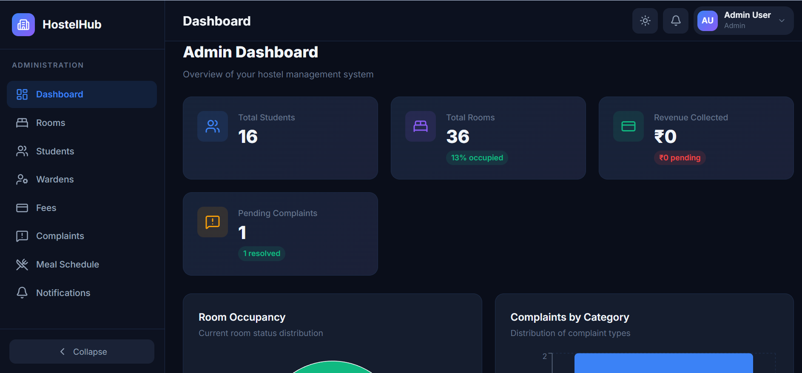
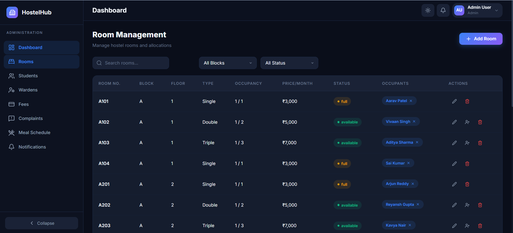
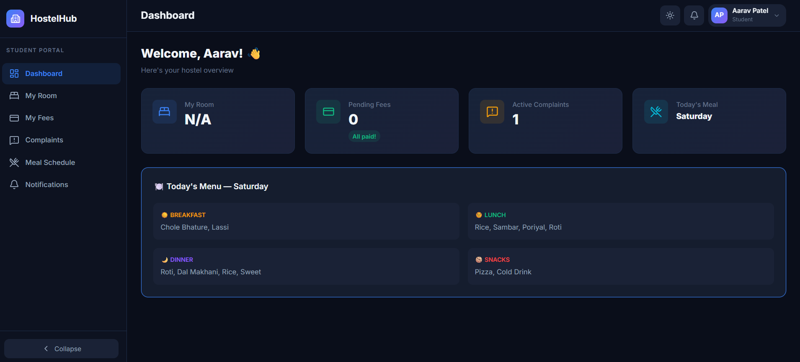
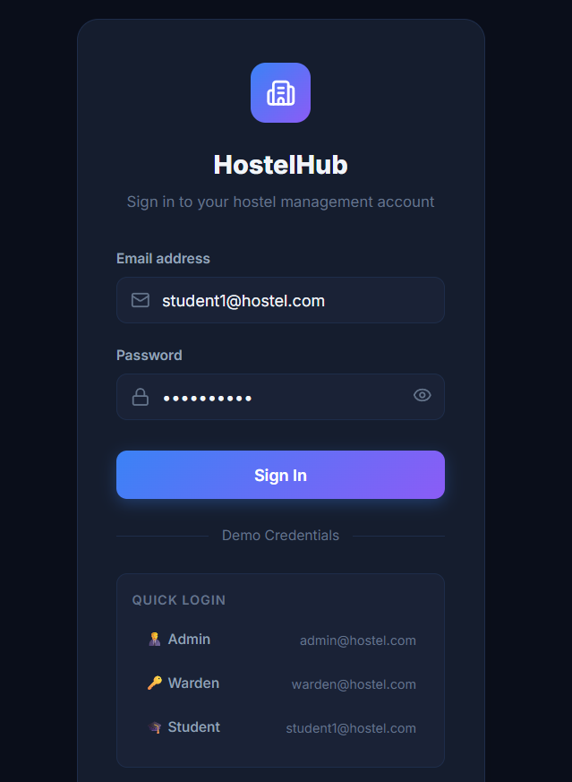

# 🏨 HostelHub — Modern Hostel Management System


> A full-stack, role-based Hostel Management System designed to streamline administrative tasks, manage rooms, track fees, and handle student complaints efficiently.

---

## 🚀 Live Demo

| Component | URL | Status |
|-----------|-----|--------|
| **Frontend** | [**View Live App**](https://hostel-management-system-rashids-projects-1801eea5.vercel.app/) |  |
| **Backend** | [**API Health Check**](https://hostel-management-system-f4pb.onrender.com/api/health) |  |

### 🔑 Demo Credentials
| Role | Email | Password | Access |
|------|-------|----------|--------|
| **Admin** | `admin@hostel.com` | `admin123` | Full access (Rooms, Students, Staff, Settings) |
| **Warden** | `warden@hostel.com` | `warden123` | Manage Complaints, Meals, Attendance |
| **Student** | `student1@hostel.com` | `student123` | View Profile, Pay Fees, File Complaints |

---

## 📸 Screenshots

| **Admin Dashboard** | **Room Management** |
|---------------------|---------------------|
|  |  |
| *Overview of stats & charts* | *Visual room grid & allocation* |

| **Student Portal** | **Login Screen** |
|--------------------|------------------|
|  |  |
| *Personalized student view* | *Secure authentication* |

> *Note: Please add your own screenshots to the `screenshots/` folder with these filenames to populate this section!*

---

## ✨ Features

### 👑 Admin Dashboard
- **Analytics**: Visual charts for occupancy rates, fee collection, and complaint status.
- **Room Management**:
  - Grid view of all hostel rooms.
  - Visual indicators for availability (Green/Red).
  - One-click allocation and deallocation.
- **Student Management**: Full CRUD operations for student records.
- **Staff Management**: Manage Wardens and other staff.

### 🛡️ Warden Panel
- **Complaint Tracking**: View and resolve student complaints.
- **Meal Management**: Update weekly meal schedules.
- **Notice Board**: Post announcements for students.

### 🎓 Student Portal
- **Profile**: View personal and room details.
- **Fees**: Check payment status and history.
- **Complaints**: File new complaints and track their status.
- **Notices**: View important announcements.

---

## 🛠️ Tech Stack

- **Frontend**: React 19, Vite, Tailwind CSS (via custom design system), Framer Motion (animations), Recharts (analytics), React Router v7.
- **Backend**: Node.js, Express.js (v5), standard MVC architecture.
- **Database**: MongoDB Atlas (Production), In-Memory MongoDB (Local Dev).
- **Authentication**: JWT (JSON Web Tokens) with secure cookie storage.
- **Deployment**: Vercel (Frontend), Render (Backend), MongoDB Atlas (DB).

---

## 📂 Project Structure

```bash
hostel-management-system/
├── client/                 # React Frontend
│   ├── src/
│   │   ├── components/     # Reusable UI components
│   │   ├── contexts/       # React Context (Auth, Theme)
│   │   ├── pages/          # Page components (Admin, Student, Shared)
│   │   ├── services/       # API integration (Axios)
│   │   └── App.jsx         # Main routing configuration
│   └── vite.config.js      # Vite configuration
│
└── server/                 # Node.js Backend
    ├── config/             # DB connection
    ├── controllers/        # Request handlers
    ├── middleware/         # Auth & validation middleware
    ├── models/             # Mongoose schemas
    ├── routes/             # API routes
    └── server.js           # Entry point
```

---

## 🔧 Local Installation

1. **Clone the repository**
   ```bash
   git clone https://github.com/rashkhan94/hostel-management-system.git
   cd hostel-management-system
   ```

2. **Install Dependencies**
   ```bash
   # Backend
   cd server
   npm install

   # Frontend
   cd ../client
   npm install
   ```

3. **Environment Setup**
   - Create a `.env` file in `server/` (see `server/.env.example` if available, or use defaults).
   - In development, the app uses an **In-Memory Database**, so no MongoDB URI is strictly required for local testing!

4. **Run the App**
   ```bash
   # Terminal 1 (Backend)
   cd server
   npm run dev

   # Terminal 2 (Frontend)
   cd client
   npm run dev
   ```

---

## 📡 API Endpoints

| Method | Endpoint | Description |
|--------|----------|-------------|
| POST | `/api/auth/login` | Authenticate user |
| GET | `/api/dashboard/stats` | Get admin dashboard analytics |
| GET | `/api/rooms` | Fetch all rooms |
| POST | `/api/complaints` | File a complaint |
| GET | `/api/meals` | Get weekly meal plan |
